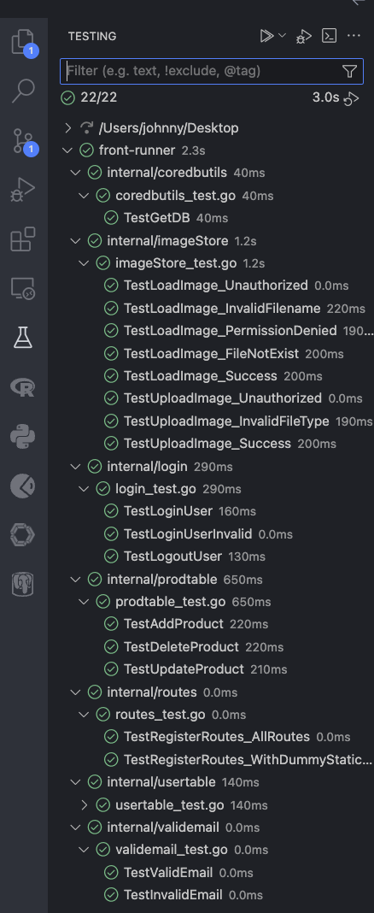

# Sprint 2
Video: [insert link here]

## Completed Work
### Front end
- Merged all Sprint 1 content to main branch
- Created skeleton for orders page
- Filled order info with large ag-grid table
	- Table contains detailed order information as well as placeholder buttons to download shipping labels and view more order info
- Significantly improved responsiveness of Home, Product, and Nav Bar components
- Implemented json based login forms using RJSF (Reach JSON Schema Form)
- Created README for dependencies and directions to start front end server
- Used RJSF to create a form to input information to create a new product
- Routing for Login and ProductForm components
- Completed styling for ProductForm component
- Moved ProductForm component to a modal rather than its own page
- Used RJSF to implement Registration (Create new account) functionality
- Completed styling for Registration component using existing Login styling
- Designed and created visually appealing Login/Register backgrounds for when users first land on the site
- Created Cypress Test for opening the ProductForm modal
- Created React unit tests
- Completed interviews with potential end-users to validate the need for a product like this
   
### Back end
- Merged all Sprint 1 content to main branch
- Updated the routing so that logging in actually redirects to main page
  - Linked login page to correct route and created function to submit login api request
- Updated so that registering an account from the registration form actually registers a user AND logs in automatically
  - Linked registration page to correct route and created function that submits registration api call AND login api call
- Updated nav bar logout button so user is actually logged out and redirected to the login screen
  - Created function so that logout button to sends a logout api request and redirects
- Updated so that clicking on the add item button from the product page actually redirects to the product form
- Updated the product form to have the required fields
  - Created function to gather image and send add_product api request
- Updated swagger docs for API
- Updated unit tests for routes
- Added unit tests for `prodtable`
- Added unit tests for `imageStore`
- Added migration functions for `user`, `product` and, `image` database tables so they are automatically made/ migrated

## Incomplete Work
### Front end
- Need to fix bug where product tags aren't being received correctly when submitting a new product
- Need to connect Product page and preview on dashboard with back end to show users' products in real time

### Back end
- Need to implement back end product filter so only products added by a specific user appear when that user is authorized (logged in)
- Need to connect the ability to edit values for each item to the front end
- Need to connect the ability to delete an item to the front end

## Testing
### Front end
_Cypress Test_

Completed a simple Cypress Test testing the opening of a modal for product creation. This test starts by opening the products page, then checks to see if the modal exists in the html yet, clicks the button to open the modal, and verifies that it is now there.


_Unit Tests_

| Unit Test | Test Description |
| --- | --- |
| `LoginForm.Test` | Tests the redering of login form, allowing user input, and submitting the form |
| `RegistrationForm.Test` | Tests the redering of login form, allowing user input, validating the input, and submitting the form |
| `NavBar.Test` | Tests the routing from the nav bar to the home, products, storefronts, and orders pages |
| `ProductForm.Test` | Tests that the Product Form popup allows user input, validates the input, and submits the form |

Tests passing:


### Back end
Each internal package has an associated unit test that can be run by entering the following command from the `front-runner_backend` directory:

```bash
go test ./internal/login # replace login with the desired internal package
```

Alternatively, the tests can be automatically run with an extension in vscode.



_Unit Tests List_

| Unit Test | Test Description |
| --- | --- |
| `TestGetDB` | Tests the GetDB function for initializing a database connection and verifies that the connection can be pinged successfully. |
| `TestLoadImage_Unauthorized` | Tests that LoadImage returns an unauthorized error when the user is not logged in. |
| `TestLoadImage_InvalidFilename` | Tests that LoadImage returns an error when the image record is not found. |
| `TestLoadImage_PermissionDenied`| Tests that LoadImage returns a forbidden error when the image record exists but belongs to a different user. |
| `TestLoadImage_FileNotExist` | tests that LoadImage returns a 404 error when the image file does not exist, even if the image record exists and the user is authorized. |
| `TestLoadImage_Success` | Tests that LoadImage successfully serves the image file when all conditions are met. |
| `TestUploadImage_Unauthorized` | Tests that UploadImage returns unauthorized when the user is not logged in. |
| `TestUploadImage_InvalidFileType` | Tests that UploadImage returns an error for non-image file uploads. |
| `TestUploadImage_Success` | Tests that UploadImage successfully uploads an image file. |
| `TestLoginUser` | Checks that logging in with valid credentials works. |
| `TestLoginUSerInvalid` | Checks that an invalid login attempt returns an error. |
| `TestLogoutUser` | Verifies that logging out clears the session. |
| `TestAddProduct` | Tests the AddProduct endpoint by simulating a multipart/form-data POST request that includes product details and an image file. It uses a valid session cookie from the fake user. It verifies that the product and associated image are stored in the database. |
| `TestDeleteProduct` | Tests the DeleteProduct endpoint by inserting a dummy product (with an associated image file) for the fake user, then simulating a deletion request with a valid session cookie. It verifies that the product is removed from the database and the image file is deleted. |
| `TestUpdateProduct` | Tests the UpdateProduct endpoint by creating a dummy product for the fake user, then simulating an update request with new description, price, and stock count. It verifies that the product is updated in the database. |
| `TestRegisterRoutes_AllRoutes` | Verifies that the router correctly matches the expected routes and HTTP methods. |
| `TestRegisterRoutes_WithDummyStaticFile` | Verifies that the static file server returns the dummy index file. |
| `TestDirectUserEntry` | Tests direct insertion of user records into the database. |
| `TestRegisterUser` | Tests the RegisterUser HTTP handler for successful user registration. |
| `TestRegisterUserEmptyFields` | Verifies that the registration endpoint returns an error when required fields are missing. |
| `TestValidEmail` | Verifies that a properly formatted email address is considered valid. |
| `TestInvalidEmail`| Verifies that improperly formatted email addresses are considered invalid. |

## API Documentation

---
title: Front Runner API v1.0
language_tabs:
  - shell: Shell
  - http: HTTP
  - javascript: JavaScript
  - ruby: Ruby
  - python: Python
  - php: PHP
  - java: Java
  - go: Go
toc_footers: []
includes: []
search: true
highlight_theme: darkula
headingLevel: 2

---

<!-- Generator: Widdershins v4.0.1 -->

<h1 id="front-runner-api">Front Runner API v1.0</h1>

> Scroll down for code samples, example requests and responses. Select a language for code samples from the tabs above or the mobile navigation menu.

API documentation for the Front Runner application.

Base URLs:

* <a href="//localhost:8080/">//localhost:8080/</a>

Email: <a href="mailto:jonathan.bravo@ufl.edu">API Support</a> 
License: <a href="http://www.apache.org/licenses/LICENSE-2.0.html">MIT</a>

<h1 id="front-runner-api-product">product</h1>

## post__api_add_product

> Code samples

```shell
# You can also use wget
curl -X POST /localhost:8080/api/add_product \
  -H 'Content-Type: multipart/form-data' \
  -H 'Accept: text/plain'

```

```http
POST /localhost:8080/api/add_product HTTP/1.1

Content-Type: multipart/form-data
Accept: text/plain

```

```javascript
const inputBody = '{
  "productName": "string",
  "description": "string",
  "price": 0,
  "count": 0,
  "tags": "string",
  "image": "string"
}';
const headers = {
  'Content-Type':'multipart/form-data',
  'Accept':'text/plain'
};

fetch('/localhost:8080/api/add_product',
{
  method: 'POST',
  body: inputBody,
  headers: headers
})
.then(function(res) {
    return res.json();
}).then(function(body) {
    console.log(body);
});

```

```ruby
require 'rest-client'
require 'json'

headers = {
  'Content-Type' => 'multipart/form-data',
  'Accept' => 'text/plain'
}

result = RestClient.post '/localhost:8080/api/add_product',
  params: {
  }, headers: headers

p JSON.parse(result)

```

```python
import requests
headers = {
  'Content-Type': 'multipart/form-data',
  'Accept': 'text/plain'
}

r = requests.post('/localhost:8080/api/add_product', headers = headers)

print(r.json())

```

```php
<?php

require 'vendor/autoload.php';

$headers = array(
    'Content-Type' => 'multipart/form-data',
    'Accept' => 'text/plain',
);

$client = new \GuzzleHttp\Client();

// Define array of request body.
$request_body = array();

try {
    $response = $client->request('POST','/localhost:8080/api/add_product', array(
        'headers' => $headers,
        'json' => $request_body,
       )
    );
    print_r($response->getBody()->getContents());
 }
 catch (\GuzzleHttp\Exception\BadResponseException $e) {
    // handle exception or api errors.
    print_r($e->getMessage());
 }

 // ...

```

```java
URL obj = new URL("/localhost:8080/api/add_product");
HttpURLConnection con = (HttpURLConnection) obj.openConnection();
con.setRequestMethod("POST");
int responseCode = con.getResponseCode();
BufferedReader in = new BufferedReader(
    new InputStreamReader(con.getInputStream()));
String inputLine;
StringBuffer response = new StringBuffer();
while ((inputLine = in.readLine()) != null) {
    response.append(inputLine);
}
in.close();
System.out.println(response.toString());

```

```go
package main

import (
       "bytes"
       "net/http"
)

func main() {

    headers := map[string][]string{
        "Content-Type": []string{"multipart/form-data"},
        "Accept": []string{"text/plain"},
    }

    data := bytes.NewBuffer([]byte{jsonReq})
    req, err := http.NewRequest("POST", "/localhost:8080/api/add_product", data)
    req.Header = headers

    client := &http.Client{}
    resp, err := client.Do(req)
    // ...
}

```

`POST /api/add_product`

*Add a new product*

Creates a new product with details including name, description, price, count, tags, and an associated image.

> Body parameter

```yaml
productName: string
description: string
price: 0
count: 0
tags: string
image: string

```

<h3 id="post__api_add_product-parameters">Parameters</h3>

|Name|In|Type|Required|Description|
|---|---|---|---|---|
|body|body|object|true|none|
|» productName|body|string|true|Product name|
|» description|body|string|true|Product description|
|» price|body|number|true|Product price|
|» count|body|integer|true|Product stock count|
|» tags|body|string|false|Product tags|
|» image|body|string(binary)|true|Product image file|

> Example responses

> 201 Response

```
"string"
```

<h3 id="post__api_add_product-responses">Responses</h3>

|Status|Meaning|Description|Schema|
|---|---|---|---|
|201|[Created](https://tools.ietf.org/html/rfc7231#section-6.3.2)|Product added successfully|string|
|400|[Bad Request](https://tools.ietf.org/html/rfc7231#section-6.5.1)|Error parsing form or uploading image|string|
|401|[Unauthorized](https://tools.ietf.org/html/rfc7235#section-3.1)|User not authenticated|string|
|500|[Internal Server Error](https://tools.ietf.org/html/rfc7231#section-6.6.1)|Internal server error|string|

<aside class="success">
This operation does not require authentication
</aside>

## put__api_update_product

> Code samples

```shell
# You can also use wget
curl -X PUT /localhost:8080/api/update_product?id=string \
  -H 'Content-Type: application/x-www-form-urlencoded' \
  -H 'Accept: text/plain'

```

```http
PUT /localhost:8080/api/update_product?id=string HTTP/1.1

Content-Type: application/x-www-form-urlencoded
Accept: text/plain

```

```javascript
const inputBody = '{
  "product_description": "string",
  "item_price": 0,
  "stock_amount": 0
}';
const headers = {
  'Content-Type':'application/x-www-form-urlencoded',
  'Accept':'text/plain'
};

fetch('/localhost:8080/api/update_product?id=string',
{
  method: 'PUT',
  body: inputBody,
  headers: headers
})
.then(function(res) {
    return res.json();
}).then(function(body) {
    console.log(body);
});

```

```ruby
require 'rest-client'
require 'json'

headers = {
  'Content-Type' => 'application/x-www-form-urlencoded',
  'Accept' => 'text/plain'
}

result = RestClient.put '/localhost:8080/api/update_product',
  params: {
  'id' => 'string'
}, headers: headers

p JSON.parse(result)

```

```python
import requests
headers = {
  'Content-Type': 'application/x-www-form-urlencoded',
  'Accept': 'text/plain'
}

r = requests.put('/localhost:8080/api/update_product', params={
  'id': 'string'
}, headers = headers)

print(r.json())

```

```php
<?php

require 'vendor/autoload.php';

$headers = array(
    'Content-Type' => 'application/x-www-form-urlencoded',
    'Accept' => 'text/plain',
);

$client = new \GuzzleHttp\Client();

// Define array of request body.
$request_body = array();

try {
    $response = $client->request('PUT','/localhost:8080/api/update_product', array(
        'headers' => $headers,
        'json' => $request_body,
       )
    );
    print_r($response->getBody()->getContents());
 }
 catch (\GuzzleHttp\Exception\BadResponseException $e) {
    // handle exception or api errors.
    print_r($e->getMessage());
 }

 // ...

```

```java
URL obj = new URL("/localhost:8080/api/update_product?id=string");
HttpURLConnection con = (HttpURLConnection) obj.openConnection();
con.setRequestMethod("PUT");
int responseCode = con.getResponseCode();
BufferedReader in = new BufferedReader(
    new InputStreamReader(con.getInputStream()));
String inputLine;
StringBuffer response = new StringBuffer();
while ((inputLine = in.readLine()) != null) {
    response.append(inputLine);
}
in.close();
System.out.println(response.toString());

```

```go
package main

import (
       "bytes"
       "net/http"
)

func main() {

    headers := map[string][]string{
        "Content-Type": []string{"application/x-www-form-urlencoded"},
        "Accept": []string{"text/plain"},
    }

    data := bytes.NewBuffer([]byte{jsonReq})
    req, err := http.NewRequest("PUT", "/localhost:8080/api/update_product", data)
    req.Header = headers

    client := &http.Client{}
    resp, err := client.Do(req)
    // ...
}

```

`PUT /api/update_product`

*Update a product*

Updates the details of an existing product (description, price, stock count) that belongs to the authenticated user.

> Body parameter

```yaml
product_description: string
item_price: 0
stock_amount: 0

```

<h3 id="put__api_update_product-parameters">Parameters</h3>

|Name|In|Type|Required|Description|
|---|---|---|---|---|
|id|query|string|true|Product ID|
|body|body|object|false|none|
|» product_description|body|string|false|New product description|
|» item_price|body|number|false|New product price|
|» stock_amount|body|integer|false|New product stock count|

> Example responses

> 200 Response

```
"string"
```

<h3 id="put__api_update_product-responses">Responses</h3>

|Status|Meaning|Description|Schema|
|---|---|---|---|
|200|[OK](https://tools.ietf.org/html/rfc7231#section-6.3.1)|Product updated successfully|string|
|401|[Unauthorized](https://tools.ietf.org/html/rfc7235#section-3.1)|User not authenticated or unauthorized|string|
|404|[Not Found](https://tools.ietf.org/html/rfc7231#section-6.5.4)|Product not found|string|

<aside class="success">
This operation does not require authentication
</aside>

<h1 id="front-runner-api-images">images</h1>

## get__api_data_image_{filename}

> Code samples

```shell
# You can also use wget
curl -X GET /localhost:8080/api/data/image/{filename} \
  -H 'Accept: image/*'

```

```http
GET /localhost:8080/api/data/image/{filename} HTTP/1.1

Accept: image/*

```

```javascript

const headers = {
  'Accept':'image/*'
};

fetch('/localhost:8080/api/data/image/{filename}',
{
  method: 'GET',

  headers: headers
})
.then(function(res) {
    return res.json();
}).then(function(body) {
    console.log(body);
});

```

```ruby
require 'rest-client'
require 'json'

headers = {
  'Accept' => 'image/*'
}

result = RestClient.get '/localhost:8080/api/data/image/{filename}',
  params: {
  }, headers: headers

p JSON.parse(result)

```

```python
import requests
headers = {
  'Accept': 'image/*'
}

r = requests.get('/localhost:8080/api/data/image/{filename}', headers = headers)

print(r.json())

```

```php
<?php

require 'vendor/autoload.php';

$headers = array(
    'Accept' => 'image/*',
);

$client = new \GuzzleHttp\Client();

// Define array of request body.
$request_body = array();

try {
    $response = $client->request('GET','/localhost:8080/api/data/image/{filename}', array(
        'headers' => $headers,
        'json' => $request_body,
       )
    );
    print_r($response->getBody()->getContents());
 }
 catch (\GuzzleHttp\Exception\BadResponseException $e) {
    // handle exception or api errors.
    print_r($e->getMessage());
 }

 // ...

```

```java
URL obj = new URL("/localhost:8080/api/data/image/{filename}");
HttpURLConnection con = (HttpURLConnection) obj.openConnection();
con.setRequestMethod("GET");
int responseCode = con.getResponseCode();
BufferedReader in = new BufferedReader(
    new InputStreamReader(con.getInputStream()));
String inputLine;
StringBuffer response = new StringBuffer();
while ((inputLine = in.readLine()) != null) {
    response.append(inputLine);
}
in.close();
System.out.println(response.toString());

```

```go
package main

import (
       "bytes"
       "net/http"
)

func main() {

    headers := map[string][]string{
        "Accept": []string{"image/*"},
    }

    data := bytes.NewBuffer([]byte{jsonReq})
    req, err := http.NewRequest("GET", "/localhost:8080/api/data/image/{filename}", data)
    req.Header = headers

    client := &http.Client{}
    resp, err := client.Do(req)
    // ...
}

```

`GET /api/data/image/{filename}`

*Retrive an image*

Fetches an image if it exists and they are authorized.

<h3 id="get__api_data_image_{filename}-parameters">Parameters</h3>

|Name|In|Type|Required|Description|
|---|---|---|---|---|
|filename|path|string|true|Filepath of image|

> Example responses

> 200 Response

<h3 id="get__api_data_image_{filename}-responses">Responses</h3>

|Status|Meaning|Description|Schema|
|---|---|---|---|
|200|[OK](https://tools.ietf.org/html/rfc7231#section-6.3.1)|OK|string|
|401|[Unauthorized](https://tools.ietf.org/html/rfc7235#section-3.1)|User is not logged in|string|
|403|[Forbidden](https://tools.ietf.org/html/rfc7231#section-6.5.3)|Permission denied|string|
|404|[Not Found](https://tools.ietf.org/html/rfc7231#section-6.5.4)|Requested image does not exist|string|
|500|[Internal Server Error](https://tools.ietf.org/html/rfc7231#section-6.6.1)|Unable to retrieve User ID|string|

<aside class="success">
This operation does not require authentication
</aside>

## post__api_data_upload

> Code samples

```shell
# You can also use wget
curl -X POST /localhost:8080/api/data/upload \
  -H 'Content-Type: multipart/form-data' \
  -H 'Accept: */*'

```

```http
POST /localhost:8080/api/data/upload HTTP/1.1

Content-Type: multipart/form-data
Accept: */*

```

```javascript
const inputBody = '{
  "filename": "string"
}';
const headers = {
  'Content-Type':'multipart/form-data',
  'Accept':'*/*'
};

fetch('/localhost:8080/api/data/upload',
{
  method: 'POST',
  body: inputBody,
  headers: headers
})
.then(function(res) {
    return res.json();
}).then(function(body) {
    console.log(body);
});

```

```ruby
require 'rest-client'
require 'json'

headers = {
  'Content-Type' => 'multipart/form-data',
  'Accept' => '*/*'
}

result = RestClient.post '/localhost:8080/api/data/upload',
  params: {
  }, headers: headers

p JSON.parse(result)

```

```python
import requests
headers = {
  'Content-Type': 'multipart/form-data',
  'Accept': '*/*'
}

r = requests.post('/localhost:8080/api/data/upload', headers = headers)

print(r.json())

```

```php
<?php

require 'vendor/autoload.php';

$headers = array(
    'Content-Type' => 'multipart/form-data',
    'Accept' => '*/*',
);

$client = new \GuzzleHttp\Client();

// Define array of request body.
$request_body = array();

try {
    $response = $client->request('POST','/localhost:8080/api/data/upload', array(
        'headers' => $headers,
        'json' => $request_body,
       )
    );
    print_r($response->getBody()->getContents());
 }
 catch (\GuzzleHttp\Exception\BadResponseException $e) {
    // handle exception or api errors.
    print_r($e->getMessage());
 }

 // ...

```

```java
URL obj = new URL("/localhost:8080/api/data/upload");
HttpURLConnection con = (HttpURLConnection) obj.openConnection();
con.setRequestMethod("POST");
int responseCode = con.getResponseCode();
BufferedReader in = new BufferedReader(
    new InputStreamReader(con.getInputStream()));
String inputLine;
StringBuffer response = new StringBuffer();
while ((inputLine = in.readLine()) != null) {
    response.append(inputLine);
}
in.close();
System.out.println(response.toString());

```

```go
package main

import (
       "bytes"
       "net/http"
)

func main() {

    headers := map[string][]string{
        "Content-Type": []string{"multipart/form-data"},
        "Accept": []string{"*/*"},
    }

    data := bytes.NewBuffer([]byte{jsonReq})
    req, err := http.NewRequest("POST", "/localhost:8080/api/data/upload", data)
    req.Header = headers

    client := &http.Client{}
    resp, err := client.Do(req)
    // ...
}

```

`POST /api/data/upload`

*Upload an image*

Uploads an image if the user is authorized.

> Body parameter

```yaml
filename: string

```

<h3 id="post__api_data_upload-parameters">Parameters</h3>

|Name|In|Type|Required|Description|
|---|---|---|---|---|
|body|body|object|true|none|
|» filename|body|string(binary)|true|Filepath of image|

> Example responses

> 200 Response

<h3 id="post__api_data_upload-responses">Responses</h3>

|Status|Meaning|Description|Schema|
|---|---|---|---|
|200|[OK](https://tools.ietf.org/html/rfc7231#section-6.3.1)|Filename of uploaded image|string|
|401|[Unauthorized](https://tools.ietf.org/html/rfc7235#section-3.1)|User is not logged in|string|
|403|[Forbidden](https://tools.ietf.org/html/rfc7231#section-6.5.3)|Permission denied|string|
|404|[Not Found](https://tools.ietf.org/html/rfc7231#section-6.5.4)|Requested image does not exist|string|
|415|[Unsupported Media Type](https://tools.ietf.org/html/rfc7231#section-6.5.13)|Invalid file type|string|
|500|[Internal Server Error](https://tools.ietf.org/html/rfc7231#section-6.6.1)|File already exists|string|

<aside class="success">
This operation does not require authentication
</aside>

<h1 id="front-runner-api-authentication">authentication</h1>

## post__api_login

> Code samples

```shell
# You can also use wget
curl -X POST /localhost:8080/api/login \
  -H 'Content-Type: application/x-www-form-urlencoded' \
  -H 'Accept: text/plain'

```

```http
POST /localhost:8080/api/login HTTP/1.1

Content-Type: application/x-www-form-urlencoded
Accept: text/plain

```

```javascript
const inputBody = '{
  "email": "string",
  "password": "string"
}';
const headers = {
  'Content-Type':'application/x-www-form-urlencoded',
  'Accept':'text/plain'
};

fetch('/localhost:8080/api/login',
{
  method: 'POST',
  body: inputBody,
  headers: headers
})
.then(function(res) {
    return res.json();
}).then(function(body) {
    console.log(body);
});

```

```ruby
require 'rest-client'
require 'json'

headers = {
  'Content-Type' => 'application/x-www-form-urlencoded',
  'Accept' => 'text/plain'
}

result = RestClient.post '/localhost:8080/api/login',
  params: {
  }, headers: headers

p JSON.parse(result)

```

```python
import requests
headers = {
  'Content-Type': 'application/x-www-form-urlencoded',
  'Accept': 'text/plain'
}

r = requests.post('/localhost:8080/api/login', headers = headers)

print(r.json())

```

```php
<?php

require 'vendor/autoload.php';

$headers = array(
    'Content-Type' => 'application/x-www-form-urlencoded',
    'Accept' => 'text/plain',
);

$client = new \GuzzleHttp\Client();

// Define array of request body.
$request_body = array();

try {
    $response = $client->request('POST','/localhost:8080/api/login', array(
        'headers' => $headers,
        'json' => $request_body,
       )
    );
    print_r($response->getBody()->getContents());
 }
 catch (\GuzzleHttp\Exception\BadResponseException $e) {
    // handle exception or api errors.
    print_r($e->getMessage());
 }

 // ...

```

```java
URL obj = new URL("/localhost:8080/api/login");
HttpURLConnection con = (HttpURLConnection) obj.openConnection();
con.setRequestMethod("POST");
int responseCode = con.getResponseCode();
BufferedReader in = new BufferedReader(
    new InputStreamReader(con.getInputStream()));
String inputLine;
StringBuffer response = new StringBuffer();
while ((inputLine = in.readLine()) != null) {
    response.append(inputLine);
}
in.close();
System.out.println(response.toString());

```

```go
package main

import (
       "bytes"
       "net/http"
)

func main() {

    headers := map[string][]string{
        "Content-Type": []string{"application/x-www-form-urlencoded"},
        "Accept": []string{"text/plain"},
    }

    data := bytes.NewBuffer([]byte{jsonReq})
    req, err := http.NewRequest("POST", "/localhost:8080/api/login", data)
    req.Header = headers

    client := &http.Client{}
    resp, err := client.Do(req)
    // ...
}

```

`POST /api/login`

*User login*

Authenticates a user and creates a session.

> Body parameter

```yaml
email: string
password: string

```

<h3 id="post__api_login-parameters">Parameters</h3>

|Name|In|Type|Required|Description|
|---|---|---|---|---|
|body|body|object|true|none|
|» email|body|string|true|User email|
|» password|body|string|true|User password|

> Example responses

> 200 Response

```
"string"
```

<h3 id="post__api_login-responses">Responses</h3>

|Status|Meaning|Description|Schema|
|---|---|---|---|
|200|[OK](https://tools.ietf.org/html/rfc7231#section-6.3.1)|Logged in successfully.|string|
|400|[Bad Request](https://tools.ietf.org/html/rfc7231#section-6.5.1)|Email and password are required|string|
|401|[Unauthorized](https://tools.ietf.org/html/rfc7235#section-3.1)|Invalid credentials|string|

<aside class="success">
This operation does not require authentication
</aside>

## post__api_logout

> Code samples

```shell
# You can also use wget
curl -X POST /localhost:8080/api/logout \
  -H 'Accept: text/plain'

```

```http
POST /localhost:8080/api/logout HTTP/1.1

Accept: text/plain

```

```javascript

const headers = {
  'Accept':'text/plain'
};

fetch('/localhost:8080/api/logout',
{
  method: 'POST',

  headers: headers
})
.then(function(res) {
    return res.json();
}).then(function(body) {
    console.log(body);
});

```

```ruby
require 'rest-client'
require 'json'

headers = {
  'Accept' => 'text/plain'
}

result = RestClient.post '/localhost:8080/api/logout',
  params: {
  }, headers: headers

p JSON.parse(result)

```

```python
import requests
headers = {
  'Accept': 'text/plain'
}

r = requests.post('/localhost:8080/api/logout', headers = headers)

print(r.json())

```

```php
<?php

require 'vendor/autoload.php';

$headers = array(
    'Accept' => 'text/plain',
);

$client = new \GuzzleHttp\Client();

// Define array of request body.
$request_body = array();

try {
    $response = $client->request('POST','/localhost:8080/api/logout', array(
        'headers' => $headers,
        'json' => $request_body,
       )
    );
    print_r($response->getBody()->getContents());
 }
 catch (\GuzzleHttp\Exception\BadResponseException $e) {
    // handle exception or api errors.
    print_r($e->getMessage());
 }

 // ...

```

```java
URL obj = new URL("/localhost:8080/api/logout");
HttpURLConnection con = (HttpURLConnection) obj.openConnection();
con.setRequestMethod("POST");
int responseCode = con.getResponseCode();
BufferedReader in = new BufferedReader(
    new InputStreamReader(con.getInputStream()));
String inputLine;
StringBuffer response = new StringBuffer();
while ((inputLine = in.readLine()) != null) {
    response.append(inputLine);
}
in.close();
System.out.println(response.toString());

```

```go
package main

import (
       "bytes"
       "net/http"
)

func main() {

    headers := map[string][]string{
        "Accept": []string{"text/plain"},
    }

    data := bytes.NewBuffer([]byte{jsonReq})
    req, err := http.NewRequest("POST", "/localhost:8080/api/logout", data)
    req.Header = headers

    client := &http.Client{}
    resp, err := client.Do(req)
    // ...
}

```

`POST /api/logout`

*User logout*

Logs out the current user by clearing the session.

> Example responses

> 200 Response

```
"string"
```

<h3 id="post__api_logout-responses">Responses</h3>

|Status|Meaning|Description|Schema|
|---|---|---|---|
|200|[OK](https://tools.ietf.org/html/rfc7231#section-6.3.1)|Logged out successfully|string|

<aside class="success">
This operation does not require authentication
</aside>

## post__api_register

> Code samples

```shell
# You can also use wget
curl -X POST /localhost:8080/api/register \
  -H 'Content-Type: application/x-www-form-urlencoded' \
  -H 'Accept: text/plain'

```

```http
POST /localhost:8080/api/register HTTP/1.1

Content-Type: application/x-www-form-urlencoded
Accept: text/plain

```

```javascript
const inputBody = '{
  "email": "string",
  "password": "string",
  "business_name": "string"
}';
const headers = {
  'Content-Type':'application/x-www-form-urlencoded',
  'Accept':'text/plain'
};

fetch('/localhost:8080/api/register',
{
  method: 'POST',
  body: inputBody,
  headers: headers
})
.then(function(res) {
    return res.json();
}).then(function(body) {
    console.log(body);
});

```

```ruby
require 'rest-client'
require 'json'

headers = {
  'Content-Type' => 'application/x-www-form-urlencoded',
  'Accept' => 'text/plain'
}

result = RestClient.post '/localhost:8080/api/register',
  params: {
  }, headers: headers

p JSON.parse(result)

```

```python
import requests
headers = {
  'Content-Type': 'application/x-www-form-urlencoded',
  'Accept': 'text/plain'
}

r = requests.post('/localhost:8080/api/register', headers = headers)

print(r.json())

```

```php
<?php

require 'vendor/autoload.php';

$headers = array(
    'Content-Type' => 'application/x-www-form-urlencoded',
    'Accept' => 'text/plain',
);

$client = new \GuzzleHttp\Client();

// Define array of request body.
$request_body = array();

try {
    $response = $client->request('POST','/localhost:8080/api/register', array(
        'headers' => $headers,
        'json' => $request_body,
       )
    );
    print_r($response->getBody()->getContents());
 }
 catch (\GuzzleHttp\Exception\BadResponseException $e) {
    // handle exception or api errors.
    print_r($e->getMessage());
 }

 // ...

```

```java
URL obj = new URL("/localhost:8080/api/register");
HttpURLConnection con = (HttpURLConnection) obj.openConnection();
con.setRequestMethod("POST");
int responseCode = con.getResponseCode();
BufferedReader in = new BufferedReader(
    new InputStreamReader(con.getInputStream()));
String inputLine;
StringBuffer response = new StringBuffer();
while ((inputLine = in.readLine()) != null) {
    response.append(inputLine);
}
in.close();
System.out.println(response.toString());

```

```go
package main

import (
       "bytes"
       "net/http"
)

func main() {

    headers := map[string][]string{
        "Content-Type": []string{"application/x-www-form-urlencoded"},
        "Accept": []string{"text/plain"},
    }

    data := bytes.NewBuffer([]byte{jsonReq})
    req, err := http.NewRequest("POST", "/localhost:8080/api/register", data)
    req.Header = headers

    client := &http.Client{}
    resp, err := client.Do(req)
    // ...
}

```

`POST /api/register`

*Register a new user*

Registers a new user using email, password, and an optional business name.

> Body parameter

```yaml
email: string
password: string
business_name: string

```

<h3 id="post__api_register-parameters">Parameters</h3>

|Name|In|Type|Required|Description|
|---|---|---|---|---|
|body|body|object|true|none|
|» email|body|string|true|User email|
|» password|body|string|true|User password|
|» business_name|body|string|false|Business name|

> Example responses

> 200 Response

```
"string"
```

<h3 id="post__api_register-responses">Responses</h3>

|Status|Meaning|Description|Schema|
|---|---|---|---|
|200|[OK](https://tools.ietf.org/html/rfc7231#section-6.3.1)|User registered successfully|string|
|400|[Bad Request](https://tools.ietf.org/html/rfc7231#section-6.5.1)|Email and password are required or invalid email format|string|
|409|[Conflict](https://tools.ietf.org/html/rfc7231#section-6.5.8)|Email already in use or database error|string|

<aside class="success">
This operation does not require authentication
</aside>
